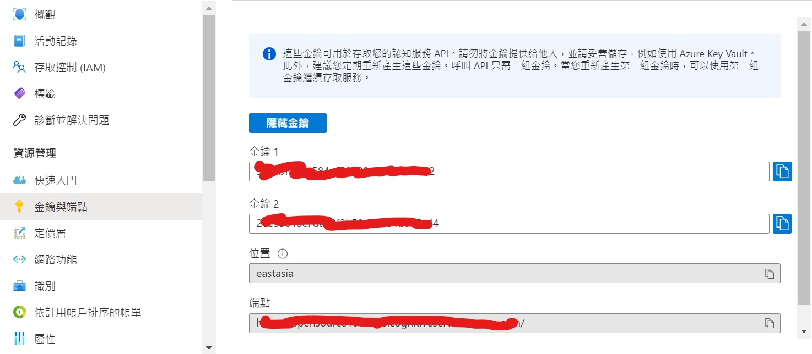
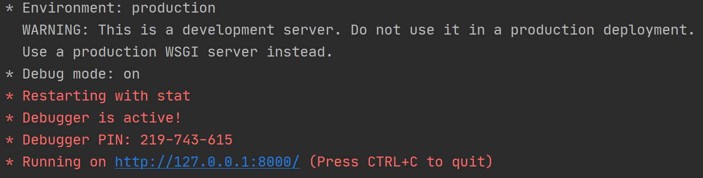
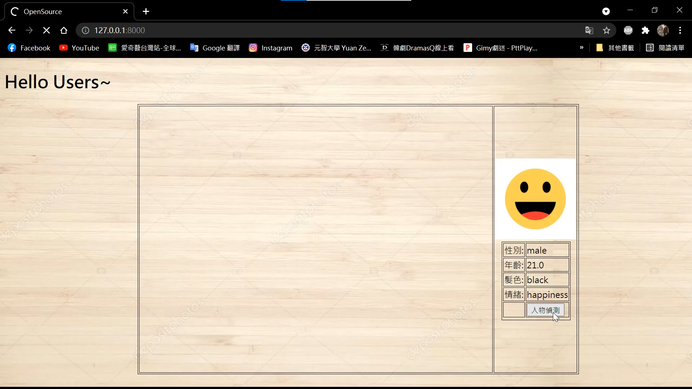

# Face Recognition
在現今疫情的狀況，人與人的互動稀少，因此能彼此面對面的感受人的情緒的機會越來越少，因此這次的專案主要是想要辨識人的影像在網路鏡頭下，關於情緒的辨識。

## Introduction
本次專案是結合 [Windows Azure 人臉辨識API](https://azure.microsoft.com/zh-tw/services/cognitive-services/face/) 以及 [Python Flask](https://towardsdatascience.com/video-streaming-in-web-browsers-with-opencv-flask-93a38846fe00) 做到情緒辨識和影像的即時串流。

本系統主要有三大功能:
1. 辨識性別
2. 辨識年齡
3. 辨識情緒以及其他面部特徵

## Dependencies
|Name|
|----|
|Flask 2.0.1|
|Python 3.7.6|
|opencv 3.4.2|
|cognitive-face 1.5.0|

## Build Process

### Installation
- 建立虛擬環境:
  ``` bash
  $ conda create --name face-recognition python=3.8
  $ conda activate face-recognition
  $ pip install -r requirements.txt
  ```
- Download:

  [~~haarcascade_frontalface_default.xml~~](https://github.com/opencv/opencv/blob/master/data/haarcascades/haarcascade_frontalface_default.xml)
  (This file is already in zip package.)

### Windows Azure API
- API帳號申請:
  
  首先透過 [Windows Azure](https://azure.microsoft.com/zh-tw/services/cognitive-services/face/) 建立帳號後申請Windows Azure Face Recognition **API金鑰**

- 取得金鑰及端點:
  
  如下圖，進入**控制中心**後點擊右方目錄的 **金鑰與端點** 就可以看到金鑰1和端點。
  
  

- Configure:

  首先，複製金鑰1到`app.py`裡的第24行，把`KEY` 改成自己的金鑰。
  - https://github.com/Robersonybr731/OpenSource/blob/master/app.py#L24
  
  然後，複製端點數值到`app.py`的第26行，把`BASE_URL`改成是自己的端點。
  - https://github.com/Robersonybr731/OpenSource/blob/master/app.py#L26

  最後,如下圖，在端點網址的最後面加上`/face/v1.0`才能真正地完成修改。
  
  
### Hardware
- WebCam

## Usage
- 輸入執行指令:
  ``` bash
  $ python3 app.py
  ```
- 前往網頁地址:

  
  執行完指令後，出現以上結果代表程式執行成功。
  
  點擊最後一行的網址就能前往網頁所在地，在這裡 [http://127.0.0.1:8000/]( http://127.0.0.1:8000/) 代表我們網頁地址。
 
- 網站介紹:
 
  
  進入網址後就會開始取得攝影機的Real Time影像。
  
  點擊 **人物偵測** 按鈕就可以取得現在影像的性別、年齡、髮色、情緒等辨識結果。

- 辨識顯示:

  
  當點擊完 **人物偵測** 按鈕後就會顯示如上圖的結果。
  
  若想要再繼續偵測影像需要再等待3秒的時間才能再次偵測。
  
## Results & Demo
### 連續辨識影像Demo
  
  
## References
[Video Streaming in Web Browsers with OpenCV & Flask](https://towardsdatascience.com/video-streaming-in-web-browsers-with-opencv-flask-93a38846fe00)

[Windows Azure Face Recognition API](https://azure.microsoft.com/zh-tw/services/cognitive-services/face/)

[Windows Azure Face Recognition Document](https://docs.microsoft.com/zh-tw/azure/cognitive-services/face/quickstarts/client-libraries?pivots=programming-language-python&tabs=visual-studio)